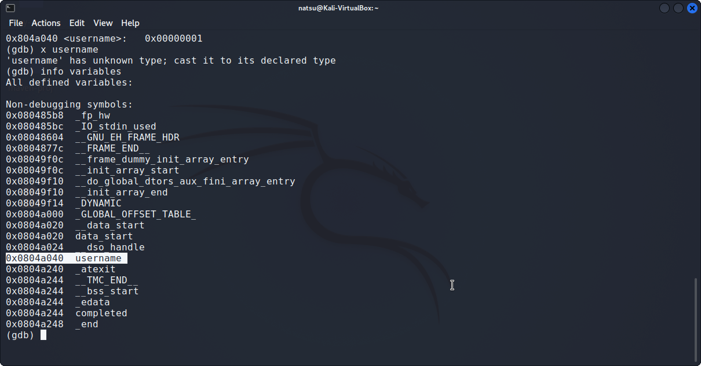

 ## ELF x86 - BSS BOF
```c
#include <stdio.h>
#include <stdlib.h>
 
char username[512] = {1};
void (*_atexit)(int) =  exit;
 
void cp_username(char *name, const char *arg)
{
  while((*(name++) = *(arg++)));
  *name = 0;
}
 
int main(int argc, char **argv)
{
  if(argc != 2)
    {
      printf("[-] Usage : %s <username>\n", argv[0]);
      exit(0);
    }
   
  cp_username(username, argv[1]);
  printf("[+] Running program with username : %s\n", username);
   
  _atexit(0);
  return 0;
}
```

Đây là một bài bss overflow, đầu tiên nhìn vào chương trình c một biến toàn cục username và một con trỏ hàm _atexit được đặt trong .bss section.
Chúng ta có thể tận dụng lỗi buffer  overflow từ hàm cp_username để exploit chương trình này.
Đầu tiên cần tìm được địa chỉ của biến username. Sử dụng câu lệnh ```info variables``` để xem địa chỉ của biến username



Tiếp theo chúng ta đặt shellcode vào trong mảng username do mảng có độ dài 512 byte sao khi đặt shellcode vào phần còn lại chúng ta đặt bất kỳ để lấp đầy mảng.Và sau đó ghi địa chỉ shellcode vào con trỏ hàm để nó thực thi được shellcode.


